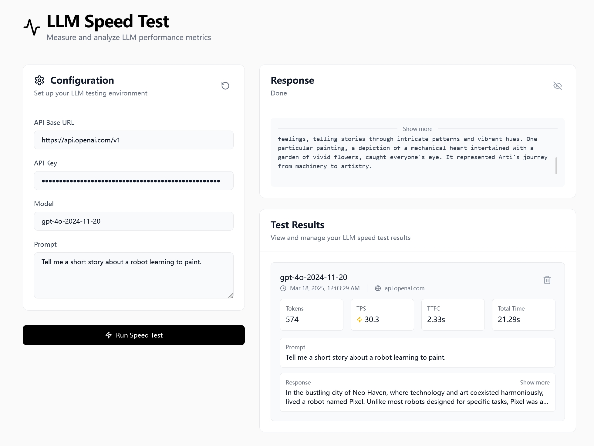

# LLM Speed Test


[](https://llmspeedtest.onrender.com/)


A web application for measuring and comparing the output speed of Large Language Models (LLMs).

## Overview

LLM Speed Test provides an easy way to benchmark the performance of different language models. It measures key metrics like:

- **Tokens Per Second (TPS)**: How fast the model generates text
- **Time To First Chunk**: How long it takes to receiving the first chunk of response
- **Total Response Time**: Overall duration from request to completion
- **Token Count**: Number of tokens in the generated response

Perfect for developers, researchers, and enthusiasts who need to compare LLM performance across different models or API endpoints.

## Features

- 🚀 Run speed tests against OpenAI and compatible API endpoints
- 📊 Collect and display performance metrics
- 🔄 Compare results across multiple tests
- 💾 Locally save test results and configurations
- 📱 Responsive design for desktop and mobile
- 🌓 Light/dark mode support

## Screenshot


## Live Demo
Try demo at [HERE](https://llmspeedtest.onrender.com/).

_This is a client-side only application. All your information is stored locally on your device._

## Development

### Prerequisites

- Node.js (latest LTS version recommended)
- npm

### Get started

1. Clone the repository:

2. Install dependencies:
   ```bash
   npm install
   ```

3. Start the development server:
   ```bash
   npm run dev
   ```

4. Open your browser and navigate to `http://localhost:5173`

### Building for Production

```bash
npm run build
```

The built files will be in the `dist` directory.

## Usage

1. Enter your API key and configure the endpoint
2. Enter the model name you want to test
3. Enter a prompt or use the default
4. Click "Run Speed Test" to start the benchmark
5. View the results and compare with previous tests

## Tech Stack

- [React](https://react.dev/) - UI framework
- [TypeScript](https://www.typescriptlang.org/) - Type safety
- [Vite](https://vitejs.dev/) - Build tool and development server
- [Tailwind CSS](https://tailwindcss.com/) - Styling
- [LangChain](https://js.langchain.com/) - LLM integration

## Contributing

Contributions are welcome! Please feel free to submit a Pull Request.

1. Fork the repository
2. Create your feature branch (`git checkout -b feature/amazing-feature`)
3. Commit your changes (`git commit -m 'Add some amazing feature'`)
4. Push to the branch (`git push origin feature/amazing-feature`)
5. Open a Pull Request

## License

This project is licensed under the GPL-2.0 License - see the [LICENSE](LICENSE) file for details.